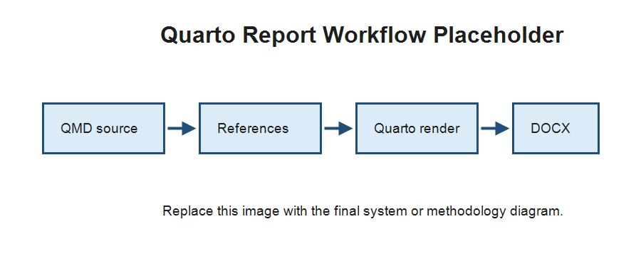

::: {custom-style="Title"}
FINAL YEAR PROJECT INTERIM REPORT
:::

::: {custom-style="Title"}
<APPROVED PROJECT ID>
:::

::: {custom-style="Title"}
Machine Learning-Based System for Cardiopulmonary Sound Separation
:::

::: {custom-style="Title"}
<STUDENT ID>
:::

::: {custom-style="Title"}
<STUDENT NAME IN CAPITAL LETTERS>
:::

::: {custom-style="Title"}
<PROGRAMME OF STUDY>
:::

::: {custom-style="Title"}
<SUBMISSION MONTH AND YEAR>
:::



::: {custom-style="Title"}
<APPROVED PROJECT ID>
:::

::: {custom-style="Title"}
Machine Learning-Based System for Cardiopulmonary Sound Separation
:::

::: {custom-style="Title"}
BY
:::

::: {custom-style="Title"}
<STUDENT ID AND NAME IN CAPITAL LETTERS>
:::

PROJECT INTERIM REPORT SUBMITTED IN PARTIAL FULFILMENT OF THE REQUIREMENT FOR THE DEGREE OF

::: {custom-style="Title"}
<PROGRAMME OF STUDY>
:::

in the

Faculty of Computing and Informatics

::: {custom-style="Title"}
MULTIMEDIA UNIVERSITY
:::

::: {custom-style="Title"}
MALAYSIA
:::

::: {custom-style="Title"}
<SUBMISSION MONTH AND YEAR>
:::



# Copyright {.unnumbered}

(c) <YEAR OF REPORT SUBMISSION> Universiti Telekom Sdn. Bhd. ALL RIGHTS RESERVED.

Copyright of this report belongs to Universiti Telekom Sdn. Bhd. as qualified by Regulation 7.2 (c) of the Multimedia University Intellectual Property and Commercialisation Policy. No part of this publication may be reproduced, stored in or introduced into a retrieval system, or transmitted in any form or by any means, or for any purpose, without the express written permission of Universiti Telekom Sdn. Bhd. Due acknowledgement shall always be made of the use of any material contained in, or derived from, this report.



# Declaration {.unnumbered}

I hereby declare that the work has been done by myself and no portion of the work contained in this report has been submitted in support of any application for any other degree or qualification of this or any other university or institution of learning.

\_\_\_\_\_\_\_\_\_\_\_\_\_\_\_\_\_\_\_\_

Name of candidate:

Faculty of Computing & Informatics

Multimedia University

Date: DD: MM: YYYY



# Acknowledgements {.unnumbered}

Placeholder acknowledgements. Replace this section after supervisor details and final acknowledgement wording are confirmed.



# Abstract {.unnumbered}

This placeholder abstract summarizes the planned FYP1 report for a machine learning-based system for cardiopulmonary sound separation. Replace this paragraph with the final abstract after the project scope, methodology, and expected deliverables are finalized.



# List of Tables {.unnumbered}

This placeholder section is reserved for the generated or Word-updated list of tables.



# List of Figures {.unnumbered}

This placeholder section is reserved for the generated or Word-updated list of figures.



# List of Abbreviations/Symbols {.unnumbered}

| Abbreviation | Description |
|---|---|
| FYP | Final Year Project |
| ML | Machine Learning |
| DOCX | Microsoft Word Open XML Document |



# List of Appendices {.unnumbered}

| Appendix | Description |
|---|---|
| Appendix A | Gantt Chart |
| Appendix B | FYP I Meeting Logs |
| Appendix C | Turnitin Similarity Index Page |
| Appendix D | Technical Documentation |



# Chapter 1: Introduction

## Overview

Placeholder content for the project overview.

## Problem Statement

Placeholder content for the problem statement.

## Project Objectives

1. Placeholder objective 1.
2. Placeholder objective 2.
3. Placeholder objective 3.

## Project Scope

Placeholder content for the project scope.

## Project Limitations

Placeholder content for project limitations.

## Methodology

The final report workflow will refer to figures by number. For example, @fig-report-workflow shows a placeholder workflow figure.

{#fig-report-workflow width=80%}

## Target Audience

Placeholder content for target audience.

## Summary

Placeholder chapter summary.

# Chapter 2: Literature Review

## Overview

Placeholder literature review text with a test citation to the existing bibliography [@onomichi2023lungseparation].

## Current Related Work Themes

Placeholder synthesis for cardiopulmonary sound separation, heart-lung sound separation, biomedical audio source separation, preprocessing, datasets, models, and evaluation metrics.

## Comparative Summary

@tbl-placeholder-comparison is a placeholder table used to verify table captions and cross-references.

| Theme | Report Use | Source Status |
|---|---|---|
| Cardiopulmonary sound separation | Core related work | To be filled from audited literature |
| Audio preprocessing | Methodology support | To be filled from audited literature |
| Evaluation metrics | Evaluation design | To be filled from audited literature |

: Placeholder literature-review comparison table {#tbl-placeholder-comparison}

## Summary

Placeholder literature review summary.

# Chapter 3: Requirements Analysis

## Overview

Placeholder content for requirements analysis.

## Fact-Finding Techniques

Placeholder content for fact-finding techniques.

## Functional Requirements

Placeholder functional requirements.

## Non-functional Requirements

Placeholder non-functional requirements.

## User Requirements

Placeholder user requirements.

# Chapter 4: System Design

## Overview

Placeholder content for system design.

## Context Diagram

Placeholder context diagram notes.

## Use Case Diagram

Placeholder use case diagram notes.

## Activity Diagram

Placeholder activity diagram notes.

## Class Diagram

Placeholder class diagram notes.

## Sequence Diagram

Placeholder sequence diagram notes.

## Interface Design

Placeholder interface design notes.

## Summary

Placeholder system design summary.

# Chapter 5: Implementation Plan

## Development Phase

Placeholder development phase.

## Testing Phase

Placeholder testing phase.

## Deployment Phase

Placeholder deployment phase, if applicable.

# Chapter 6: Conclusion

Placeholder conclusion for FYP1 progress and next-phase work.

# References {.unnumbered}

::: {#refs}
:::



# Appendix A: Gantt Chart {.unnumbered}

Placeholder for Gantt chart.



# Appendix B: FYP I Meeting Logs {.unnumbered}

Placeholder for at least six FYP I meeting logs.



# Appendix C: Turnitin Similarity Index Page {.unnumbered}

Placeholder for Turnitin Similarity Index page. Overall Similarity Index must be <= 20%.



# Appendix D: Technical Documentation {.unnumbered}

Placeholder for technical documentation, specification documents, design documents, and prototype code listings if needed.
