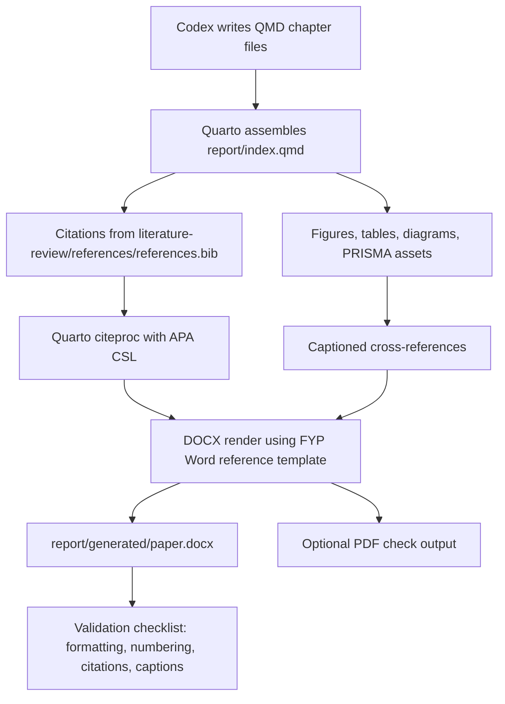

# FYP1 Report Generation Plan

Project title: **Machine Learning-Based System for Cardiopulmonary Sound Separation**

Main recommendation: **Use Quarto as the report authoring and automation workflow, generate DOCX as the primary university-compatible output, and generate PDF only as a checking/backup output.**

Do not use pure LaTeX as the main workflow. Do not manually format the final report in Word. The clean active workflow now lives under `report/quarto/`; the old `resources/tools/FYP1-main/` folder remains untouched because the latest instruction says not to archive it yet.

## Implementation Status: 2026-05-16

| Item | Status |
|---|---|
| Active Quarto workflow folder | Created at `report/quarto/`. |
| Main source file | Updated at `report/quarto/paper.qmd` with FYP front matter and included Chapter 1-3 sources. |
| Quarto project config | Created at `report/quarto/_quarto.yml`. |
| DOCX reference template | Copied to `report/quarto/templates/fyp-reference.docx` from the current resource template. |
| Cover/title reference template | Copied to `report/quarto/templates/fyp-cover-title-reference.docx`. |
| Bibliography integration | Linked directly to `../../literature-review/references/references.bib`; literature-review data was not modified. |
| Placeholder figure asset | Created at `report/quarto/assets/figures/report-workflow-placeholder.png`. |
| Render helper | Updated at `report/quarto/scripts/render-report.ps1`; it renders DOCX and then runs DOCX post-processing. |
| Validation helper | Updated at `report/quarto/scripts/validate-report.ps1`; it checks source files, output DOCX, front-matter order, section count, heading numbering, header/footer font sizes, and Word field update settings. |
| DOCX post-processing | Added at `report/quarto/scripts/fix-docx-format.py`. |
| Chapter imports | Added under `report/quarto/chapters/chapter-1.qmd`, `chapter-2.qmd`, and `chapter-3.qmd`. |
| DOCX render test | Successful; output generated at `report/generated/paper.docx`. |
| PDF render test | Not performed; PDF remains optional. |
| Old tool archive | Not performed. The user explicitly requested not to archive `FYP1-main` yet. |

## Decision

| Option | Recommendation | Reason |
|---|---|---|
| Quarto + Markdown/QMD -> DOCX | Use as primary workflow. | Best fit for automated chapter writing, citations, figures/tables, and Word output. |
| Quarto + Typst -> PDF | Use as optional checking/backup output. | The old tool already has useful Typst logic, but PDF is not the main submission format. |
| Pure LaTeX | Do not use as main workflow. | The university expects MS Word format; LaTeX would add conversion friction. |
| Manual Word editing | Avoid. | It breaks repeatability and makes Codex automation harder. |

## Current Tool Situation

- `resources/tools/FYP1-main/` is useful but outdated.
- It uses Quarto and a custom Typst extension.
- It appears designed mainly for PDF output.
- It bundles an older `FYP Handbook T2510.pdf`, while the current source of truth is `resources/guidelines/FYP Handbook T2610.pdf`.
- It does not currently provide a DOCX-first workflow.
- Quarto is now available on PATH. DOCX rendering succeeded on 2026-05-16.
- Quarto's automatic DOCX TOC is disabled because it inserts the TOC before the cover pages. A Word TOC field is placed manually in `paper.qmd` after the abstract.
- A post-render DOCX script is used because Quarto/Pandoc alone does not reliably handle the required FYP cover/title, Roman front-matter numbering, Arabic Chapter 1 restart, and heading-style numbering cleanup in one pass.

## Current Formatting Method: 2026-05-16

The chosen method is:

1. Maintain `paper.qmd` as the main Quarto source in handbook order.
2. Keep Chapter 1, Chapter 2, and Chapter 3 in `report/quarto/chapters/`.
3. Use `templates/fyp-reference.docx` as the Quarto DOCX reference document.
4. Recreate the cover and title pages in `paper.qmd` using the structure of `templates/fyp-cover-title-reference.docx`, `resources/templates/Sample.pdf`, and the FYP handbook.
5. Disable Quarto's automatic TOC in `_quarto.yml`.
6. Insert a Word TOC field in `paper.qmd` after the abstract.
7. Run `scripts/fix-docx-format.py` after Quarto render to:
   - remove Word-template heading numbering from Heading 1-3 styles;
   - keep cover/title pages unnumbered;
   - set front matter to lower-case Roman numerals starting at iii;
   - restart Chapter 1 with Arabic numbering from page 1;
   - update header/footer text to `Project ID: 985`, `Prepared by: AL-SALOUL, ASHRAF ALI HUSSEIN`, `CPT6314`, and `2610 Term`;
   - set generated header text to 10 pt and generated footer text to 8 pt;
   - enable Word field updates when the DOCX is opened.

This is an automated workflow fix, not a manual edit to `report/generated/paper.docx`.

## Target Workflow



## Active Source Structure

Reuse the existing `report/` folder and keep chapter ownership clear:

```text
report/
  quarto/
    _quarto.yml
    paper.qmd
    README.md
    chapters/
      chapter-1.qmd
      chapter-2.qmd
      chapter-3.qmd
    assets/
      figures/
        mmu-logo.png
        report-workflow-placeholder.png
    templates/
      fyp-reference.docx
      fyp-cover-title-reference.docx
    styles/
      apa.csl
    scripts/
      render-report.ps1
      validate-report.ps1
      fix-docx-format.py
  generated/
    .gitkeep
    paper.docx
    paper.pdf
```

Notes:

- The existing chapter folder names can remain.
- `chapter-3-methodology/` can hold the FYP1 "Requirements Analysis" source for now, or it can be renamed later if the user wants exact handbook naming.
- `chapter-4-design-and-implementation/` can hold the FYP1 "System Design" source for now, or it can be split later for FYP2.
- `generated/` should be ignored as output and should be the only destination for generated DOCX/PDF files.

## Active Files Created

| File | Purpose |
|---|---|
| `report/quarto/_quarto.yml` | Quarto project configuration, bibliography path, output settings, cross-reference settings, and format definitions. |
| `report/quarto/paper.qmd` | Main FYP1 report source in handbook order, including front matter and Chapter 1-3 includes. |
| `report/quarto/chapters/chapter-1.qmd` | Imported Chapter 1 source. |
| `report/quarto/chapters/chapter-2.qmd` | Imported Chapter 2 source. |
| `report/quarto/chapters/chapter-3.qmd` | Imported Chapter 3 source. |
| `report/quarto/README.md` | Current active workflow instructions only. |
| `report/quarto/templates/fyp-reference.docx` | DOCX reference template derived from `resources/templates/Template - Content.docx`. |
| `report/quarto/templates/fyp-cover-title-reference.docx` | Cover/title template copy derived from `resources/templates/Template - Cover Page and Title Page.docx`. |
| `report/quarto/styles/apa.csl` | Local APA-like CSL fallback for render testing. Replace with the official APA CSL before final submission if exact APA formatting is required. |
| `report/quarto/scripts/render-report.ps1` | Repeatable render command. |
| `report/quarto/scripts/validate-report.ps1` | Local validation checklist. |
| `report/quarto/scripts/fix-docx-format.py` | Automated DOCX section, page-numbering, heading-numbering, and header/footer post-processor. |
| `report/generated/.gitkeep` | Keeps the generated output folder present before first render. |
| `report/generated/paper.docx` | Latest generated DOCX output. |

## Files to Keep

- Keep `resources/tools/FYP1-main/` unchanged as a reference copy.
- Keep `resources/guidelines/FYP Handbook T2610.pdf` as the source of truth.
- Keep `resources/templates/*.docx` as Word-template references.
- Keep all `literature-review/` data untouched.
- Keep existing `report/` chapter folders unless the user approves a rename.

## Old Tool Handling

- Do not replace `resources/tools/FYP1-main/paper.qmd`.
- Do not replace `resources/tools/FYP1-main/_extensions/mmu-fyp/*`.
- Do not replace `literature-review/references/references.bib`.
- Do not archive the old tool yet. Keep `resources/tools/FYP1-main/` available as a reference only.

## Quarto Configuration Direction

The active workflow currently uses `report/quarto/paper.qmd` as the assembly file and imports Chapter 1, Chapter 2, and Chapter 3 from separate files under `report/quarto/chapters/`:

```markdown



```

The future Quarto configuration should use:

```yaml
bibliography: ../../literature-review/references/references.bib
csl: styles/apa.csl
format:
  docx:
    reference-doc: templates/fyp-reference.docx
    toc: false
```

PDF should be a secondary format:

```yaml
format:
  typst:
    toc: true
```

If the old Typst extension is reused, copy it into `report/_extensions/` later and update it against T2610 before rendering.

## How Codex Should Write Chapters

Codex should write one chapter source file at a time, using the handbook structure:

- Chapter 1: Introduction
  - Overview
  - Problem Statement
  - Project Objectives
  - Project Scope
  - Project Limitations
  - Methodology
  - Target Audience
  - Summary
- Chapter 2: Literature Review
  - Use the audited literature-review records and `references.bib`.
  - Focus on cardiopulmonary sound separation, heart-lung sound separation, biomedical audio source separation, preprocessing, models, datasets, metrics, and research gaps.
- Chapter 3: Methodology
  - Use application-based software-engineering methodology, dataset preparation, preprocessing, model approach, system modules, tools, and evaluation methodology.
- Chapter 4: System Design
  - Include context diagram, use case diagram, use case descriptions, activity diagram, class diagram, sequence diagram, and interface design.
- Chapter 5: Implementation Plan
  - Development phase, testing phase, deployment phase if applicable.
- Chapter 6: Conclusion
  - Achievements so far, remaining FYP2 work, issues encountered.

## Citation Workflow

Use:

```text
literature-review/references/references.bib
```

Rules:

- Do not copy or regenerate the bibliography unless the literature-review phase asks for it.
- Cite in QMD using Pandoc citation syntax, for example `[@citationKey]`.
- Use APA CSL for DOCX.
- Validate that every citation key used in chapters exists in `references.bib`.
- Validate that generated references are APA-style and use hanging indents/double spacing in DOCX.

## Figures, Tables, Captions, and Diagrams

Use Quarto cross-reference syntax:

```markdown
{#fig-system-architecture}
```

Refer to figures in text:

```markdown
As shown in @fig-system-architecture, ...
```

Tables should use captions above the table where DOCX permits it. This must be validated after the first render because DOCX caption placement can differ from PDF/Typst behavior.

Diagram sources:

- Keep Mermaid or PlantUML source files in `diagrams/` or `report/assets/diagrams/`.
- Render DOCX-friendly images, preferably PNG, before including them.
- Include `literature-review/prisma/prisma_flow_diagram.png` directly or copy it into `report/generated/assets/` at render time. Do not modify the literature-review PRISMA source during report generation.

## Appendices

Required FYP1 appendices:

- Appendix A: Gantt Chart
- Appendix B: FYP I Meeting Logs
- Appendix C: Turnitin Similarity Index Page
- Appendix D: Technical documentation, if needed

Implementation notes:

- Appendices must be referenced from the body text.
- Meeting logs and Turnitin PDF pages may need conversion to images for DOCX insertion.
- Raw LaTeX `\includepdf` comments from the old tool should not be used for DOCX.

## DOCX Output Plan

Primary command:

```powershell
powershell -ExecutionPolicy Bypass -File .\report\quarto\scripts\render-report.ps1
```

Expected output:

```text
report/generated/paper.docx
```

DOCX validation must check:

- Cover and title page layout.
- Body margins: left 38 mm, right 28 mm, top 28 mm, bottom 28 mm.
- Cover/title margins: 25.4 mm all sides.
- Normal text: Arial or Calibri, 11 pt, justified.
- Heading sizes: 14 pt bold for chapter heading, 12 pt bold for sub-heading, 11 pt bold for sub-sub-heading.
- Line spacing and paragraph indentation.
- Top-right page numbers.
- Roman preliminary page numbering.
- Arabic body numbering starting at Chapter 1.
- TOC, List of Tables, List of Figures, List of Abbreviations/Symbols, List of Appendices.
- Figure captions below figures.
- Table captions above tables.
- APA citations and reference list formatting.

## PDF Output Plan

PDF is optional and secondary.

Preferred options, in order:

1. Generate PDF from the validated DOCX using Word or LibreOffice headless, so the PDF mirrors the actual submission file.
2. Reuse the old Quarto Typst extension as an optional PDF renderer after updating it to T2610.

Do not make PDF the source of truth.

## Old FYP1-main Refactor Plan

If approved in a later phase, refactor by copying useful parts rather than editing the old folder in place.

Target folder:

```text
report/_extensions/mmu-fyp-typst/
```

Files to keep or reuse:

- `resources/tools/FYP1-main/logo.png`
- Concept from `_extensions/mmu-fyp/typst-template.typ`
- Concept from `_extensions/mmu-fyp/typst-show.typ`
- Chapter skeleton ideas from `paper.qmd`

Files to avoid copying as active sources:

- `resources/tools/FYP1-main/FYP Handbook T2510.pdf`
- `resources/tools/FYP1-main/handbookMarkDown.md`
- `resources/tools/FYP1-main/references.bib`
- `resources/tools/FYP1-main/images/example.png`
- `resources/tools/FYP1-main/showcase/showcase.gif`

Files to update during refactor:

- Change body font from Arial 12 pt to Arial/Calibri 11 pt.
- Update chapter structure to T2610 application-based wording.
- Replace "Rich Picture Diagram" with "Context Diagram".
- Link bibliography to `../literature-review/references/references.bib`.
- Add DOCX output configuration.
- Add output directory `report/generated/`.
- Add APA CSL for DOCX.
- Add Word reference template support.

How to include diagrams and PRISMA:

- Reference stable image paths from `report/assets/diagrams/`.
- Use `literature-review/prisma/prisma_flow_diagram.png` as a read-only source.
- Add a render step that can copy generated diagram assets into `report/generated/assets/` without changing the literature-review folder.

How to generate List of Figures and List of Tables:

- For PDF/Typst, reuse or update the old Typst outline logic.
- For DOCX, use Word fields or a post-processing step if Quarto/Pandoc output does not generate complete lists automatically.
- Validate the generated DOCX in Word before submission.

## Quarto Installation Steps

Current check:

```powershell
quarto --version
```

Current result: Quarto is available on PATH.

Install steps for Windows:

1. Download the Windows installer from `https://quarto.org/docs/get-started/`.
2. Install Quarto using the MSI installer.
3. Close and reopen PowerShell.
4. Run:

```powershell
quarto --version
```

5. If reusing the old Typst extension, make sure the installed Quarto version satisfies the extension requirement `>=1.8.0`, or update the extension after checking current Quarto compatibility.
6. Optional: install the Quarto VS Code extension for preview while editing.

## Future Verification Commands

```powershell
quarto --version
quarto render report/quarto/paper.qmd --to docx --output-dir report/generated
quarto render report/quarto/paper.qmd --to typst --output-dir report/generated
```

Expected checks after render:

- `report/generated/paper.docx` exists.
- Optional `report/generated/paper.pdf` exists if PDF generation is enabled.
- Citations compile without missing keys.
- References render from `literature-review/references/references.bib`.
- Figure and table captions appear in the correct positions.
- Generated files are placed only in `report/generated/`.

## Render Test Result: 2026-05-16

DOCX command:

```powershell
powershell -ExecutionPolicy Bypass -File .\report\quarto\scripts\render-report.ps1
```

Result:

```text
Rendering DOCX...
Applying FYP DOCX formatting post-process...
Post-processed DOCX formatting: ...\report\generated\paper.docx
Render complete.
```

Validation result:

```powershell
powershell -ExecutionPolicy Bypass -File .\report\quarto\scripts\validate-report.ps1
```

Result:

```text
PASS: paper.qmd exists
PASS: chapter-1.qmd exists
PASS: chapter-2.qmd exists
PASS: chapter-3.qmd exists
PASS: literature-review references.bib exists
PASS: DOCX post-processing script exists
PASS: Quarto available on PATH
PASS: DOCX output exists
PASS: cover appears before table of contents
PASS: chapter 1 appears after front matter
PASS: no obvious repeated subsection numbering
PASS: Word fields update on open
PASS: at least three section properties
PASS: Heading styles do not add their own numbering
```

Remaining manual checks:

- Open `report/generated/paper.docx` in Microsoft Word and update fields if prompted so the TOC displays final page numbers.
- Visually verify exact page-number placement, margins, heading sizes, table/list pages, and APA reference layout.
- PDF output was not generated because it remains optional.
- Do not archive the old tool yet; the latest user instruction says not to archive it.

## Phase Boundary

Chapter 1, Chapter 2, and Chapter 3 are imported into the active Quarto workflow.
DOCX was generated successfully at `report/generated/paper.docx`.
PDF was not generated because it is optional.
No `literature-review/` tracking data was modified.
